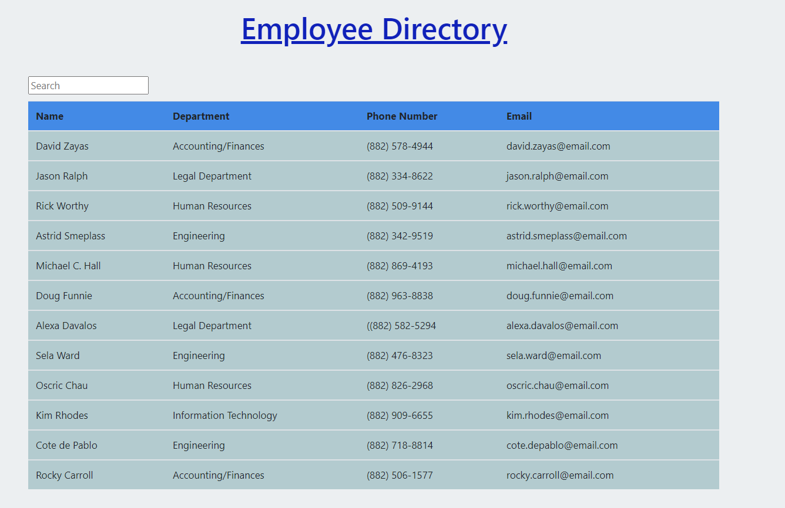
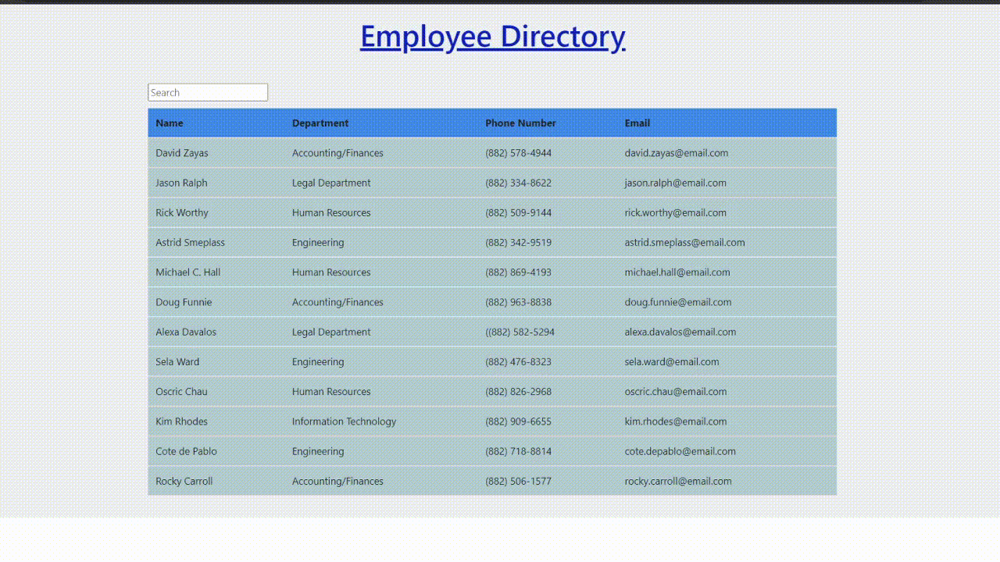

# Welcome to Employee Directory by Joy Chen

  
 

 
  
## Description
  
This application allows you to view your employees and their nonsensitive information. You can filter the employees by their names or you can sort them aphabetically by clicking on the Name header. 
If you want to see a deployed demo of the application, visit the live site at https://employee-directory-byjoy.netlify.app/

## User Story

As a manager in the company, I want to view employees by their names, so that I can have an overview of all the employees or filter to find the employee I want to view

  
## Table of Contents
* [Installation](#installation)
* [Usage](#usage)
* [License](#license)
* [Demo](#demo)
* [Questions](#questions)

  
## Installation

To use this application, run the following commands in your terminal to install the appropriate packages

    npm install

## Usage 

After you've installed the packages, you can run the application by running the follow command in your terminal

    npm run

The names in the JSON file are strictly filler employees. To input your own employees, feel free to change the employee.json file to your company's employees.

## License
 

## Demo

## Questions
  
If you see any improvements that can be made, please email me at joychen5069@gmail.com. You can also visit my GitHub page at https://github.com/joychen5069 or visit the Employee Directory page at https://github.com/joychen5069/EmployeeDirectory

  